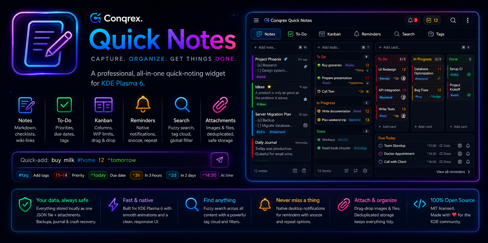

<p align="center">
  
</p>

<p align="center">
  <b>Capture. Organize. Get things done.</b><br>
  A professional, all-in-one quick-noting widget for KDE Plasma 6 —
  notes, to-dos, kanban, reminders and search in one panel popup,
  with your data safe in a single local JSON file.
</p>

<p align="center">
  
  
  
</p>

<p align="center">
  <a href="#-install">Install</a> ·
  <a href="#-features">Features</a> ·
  <a href="#-quick-add-tokens">Quick-add</a> ·
  <a href="#-where-your-data-lives">Data</a> ·
  <a href="#-development">Development</a>
</p>

---

## ✨ Features

|     |     |
| --- | --- |
| 📝 **Notes** | Markdown bodies (bold/italic/code/lists/links), inline `- [ ]` checklists, per-note neon colors, pin, archive, recoverable trash, Obsidian-style `[[wiki-links]]` with backlinks. |
| ✅ **To-Do** | Status cycling (To Do → In Progress → Done), priorities, due dates, tags, quick-add. |
| 📋 **Kanban** | Fit-to-width columns with WIP limits, positional drag & drop, card editor, per-column quick-add. |
| ⏰ **Reminders** | Time-chip picker (In 1h · Tonight · Tomorrow · Custom calendar), repeats, native notifications, snooze, overdue badges. |
| 🔎 **Search** | Global fuzzy search across everything + tag cloud; rename-safe tags filter every mode at once. |
| 🖼 **Attachments** | Drag-drop images/files; content-addressed, deduplicated, reference-counted storage. |
| 🧊 **Conqrex dark look** | Banner-style navy-neon theme out of the box; one toggle to follow your system theme. |
| 🛟 **Data safety** | Atomic flock-serialized saves, rolling backups, crash-recovery journal, JSON/Markdown export, merge/replace import. |

The panel icon shows live badges for **overdue reminders** and **open to-dos**,
and its tooltip previews your next reminder.

## 📦 Install

```sh
git clone <repo-url>
cd Conqrex.QuickNotes
./install.sh            # installs or upgrades, per-user (no sudo)
```

Right-click your desktop or panel → **Add Widgets** → search **Conqrex Quick Notes**.

<details>
<summary>Reload Plasma after upgrading a local install</summary>

```sh
kquitapp6 plasmashell && kstart plasmashell
```

</details>

Package id: `com.conqrex.quicknotes`

## ⌨️ Quick-add tokens

Type in the always-visible add bar:

```
buy milk #home !2 ^tomorrow
```

- `#tag` — add a tag (repeatable)
- `!1`–`!4` or `!low` `!med` `!high` `!urgent` — priority
- `^today` `^tomorrow` `^3h` `^2d` `^14:30` — due date

Tokens are optional power-user shortcuts; Reminders has a visual time picker.
(Reminders have no priority field, so a `!` token there is left in the text
instead of being applied.)

## 🗃 Where your data lives

Everything is one JSON document (plus an `attachments/` blob store) under:

```
~/.local/share/conqrex/quicknotes/
├── store.json        # the single source of truth
├── attachments/      # content-addressed image/file blobs
├── backups/          # rolling + pre-migration + pre-import snapshots
└── journal/          # last-good copy for crash recovery
```

This is **outside the widget package**, so `kpackagetool6 -u` / reinstalls never
touch your notes. Saves are flock-serialized and atomic (write-temp + fsync +
rename) with a last-good journal, so an interrupted write can't corrupt your data.

Use the widget's **⋮ (Data)** menu to **Export to JSON**, **Export notes to
Markdown**, **Import** (merge or replace), **Back up now**, **Clean up unused
attachments**, or **Open the data folder**. You can point the widget at a
different folder in **Settings → Data directory**.

> **Reminders** fire only while plasmashell is running; when you open the widget
> it catches up on anything that came due while it was closed.

## 🛠️ Development

The data layer is a plain shell broker you can drive directly:

```sh
S=package/contents/code/store.sh
QN_DATA_DIR=/tmp/qn bash "$S" init   | jq .
QN_DATA_DIR=/tmp/qn bash "$S" load   | jq .
QN_DATA_DIR=/tmp/qn bash "$S" stat   | jq .
```

Live-preview the UI without installing (needs `plasma-sdk`):

```sh
sudo pacman -S plasma-sdk
plasmoidviewer -a ./package -f planar     -l floating    # desktop
plasmoidviewer -a ./package -f horizontal -l topedge     # panel
QT_LOGGING_RULES="qml.debug=true" plasmoidviewer -a ./package   # console.log
```

Or, after installing:

```sh
plasmawindowed com.conqrex.quicknotes
```

## 🏛 Architecture

`main.qml` owns the entire in-memory document (`root.doc`). The views are dumb
renderers that call intent functions, which apply a **pure operation** from
`code/model.js`, reassign `root.doc` (firing bindings), and schedule a debounced
save. **`code/store.sh` is the only thing that touches the filesystem**, invoked
through a single `Plasma5Support.DataSource`. Markdown rendering HTML-escapes note
bodies before producing RichText, so content can't inject markup.

## 🐙 Sibling projects

[**Conqrex.OctoPulse**](https://github.com/Conqrex/Conqrex.OctoPulse) — every GitHub Actions run in one panel widget.
[**Conqrex.Dockswain**](https://github.com/Conqrex/Conqrex.Dockswain) — manage Docker hosts over SSH from your panel.

## 📄 License

MIT © S. Aydin Icen
